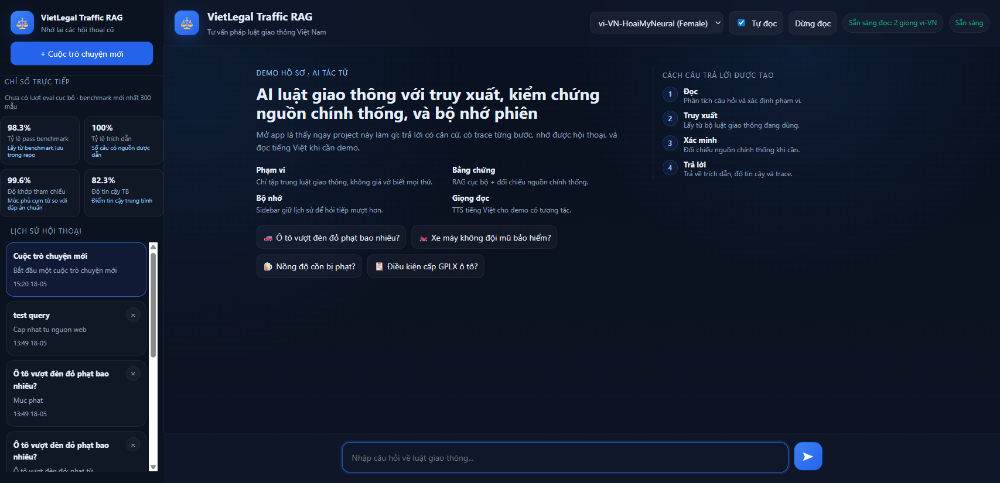

# VietLegal Traffic RAG

Scoped Vietnamese traffic-law demo for portfolio and interviews.

## What this Space shows

- narrow traffic-law scope instead of broad legal-AI claims
- answers grounded in citations
- short-term session memory and history recovery
- optional official-source web verification
- Vietnamese TTS for live demos
- benchmark-backed evaluation in the source repo

## Quick demo

Try:

- a traffic penalty question
- a follow-up question that depends on memory
- refresh the page and confirm history returns
- an out-of-scope question and watch the refusal

For a 2-3 minute talk track, see [the demo script](https://github.com/lyhoangai/vietlegal-traffic-rag/blob/main/docs/demo-script.md).

## Links

- GitHub repo: <https://github.com/lyhoangai/vietlegal-traffic-rag>
- Benchmark summary: <https://github.com/lyhoangai/vietlegal-traffic-rag/blob/main/docs/benchmarks/latest_summary.md>
- Source README template: <https://github.com/lyhoangai/vietlegal-traffic-rag/blob/main/README.hf-space.md>

## Notes

- free Spaces can sleep after inactivity, so the first wake-up may be slow
- free storage is non-persistent, so chat history and rebuilt Chroma state can reset on restart
- add `GROQ_API_KEY` in the Space settings before testing `/chat`
